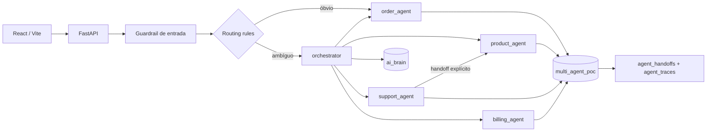
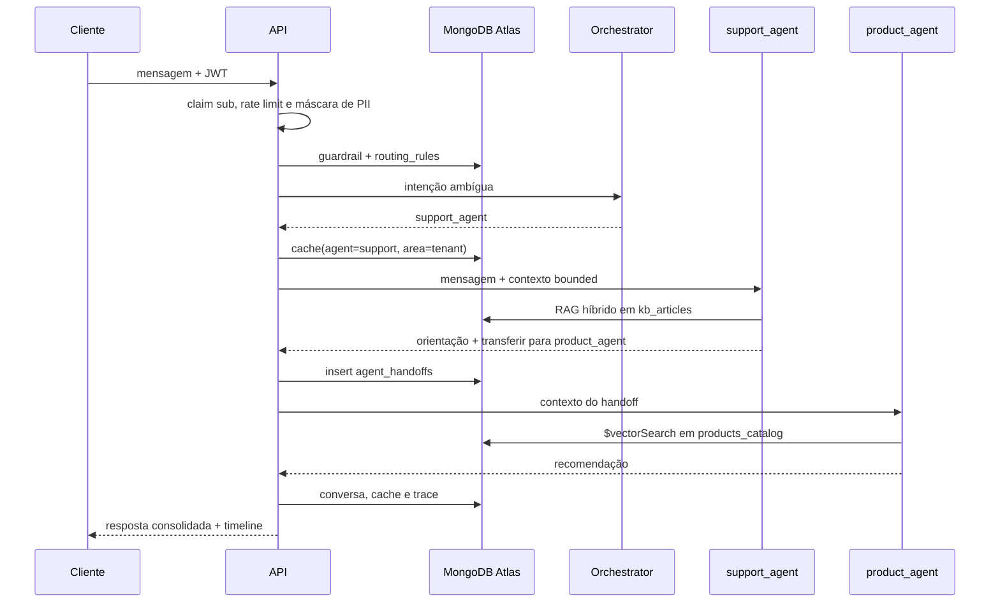

# Arquitetura

## Topologia

## Fluxo de um turno com handoff

## Limites de segurança

- O token define `customer_key`; campos de identidade do payload são ignorados.
- Filtros de pedido e fatura são reconstruídos do zero com ownership.
- Somente `order_agent` recebe a ferramenta de escrita, limitada a `$set.status` e estados aprovados.
- O plano `ai_brain` é alterado somente pelos endpoints administrativos.
- Conversas são bounded a 20 mensagens e expiram em uma hora; eventos e auditoria expiram em 30 dias.

## Retrieval

- Catálogo: `autoEmbed` com `voyage-4`, `indexingMethod: flat` e filtros `active`, `category`, `price`.
- Base de suporte: ranking vetorial e BM25 combinados com RRF.
- Memória longa: um documento por fato, com `customer_key + active` no índice vetorial.
- Cache: índice vetorial particionado por `agent + area + customer_key`; o terceiro filtro impede compartilhamento de respostas entre clientes da mesma área. A implementação também aceita hit exato para uma demonstração determinística.
