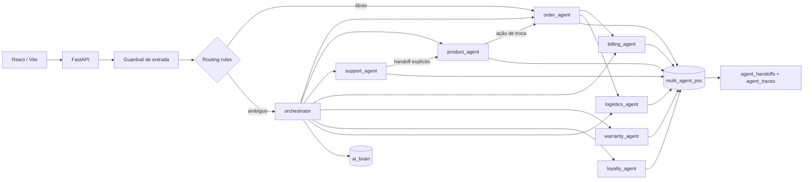
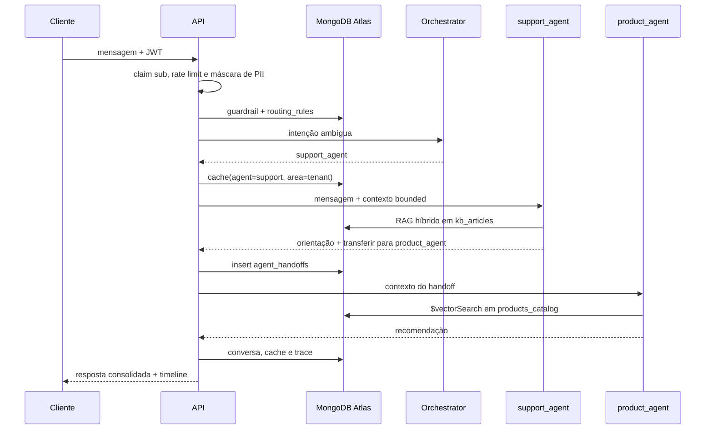

# Arquitetura

## Topologia

## Fluxo de um turno com handoff

## Limites de segurança

- O token define `customer_key`; campos de identidade do payload são ignorados.
- Filtros de pedido e fatura são reconstruídos do zero com ownership.
- Somente `order_agent` recebe a ferramenta de escrita, limitada a `$set.status` e estados aprovados.
- O plano `ai_brain` é alterado somente pelos endpoints administrativos.
- Conversas são bounded a 20 mensagens e expiram em 24 horas; eventos e auditoria expiram em 30 dias.
- `conversation_id` e memória de curto prazo são validados junto com o `customer_key`; conhecer um ID não permite retomar ou sobrescrever a conversa de outro cliente.

## Retrieval

- Catálogo: `autoEmbed` com `voyage-4`, `indexingMethod: flat` e filtros `active`, `category`, `price`.
- Base de suporte: ranking vetorial e BM25 combinados com RRF.
- Memória longa: um documento por fato, com `customer_key + active` no índice vetorial.
- Cache curto: índice vetorial particionado por `session_id + customer_key + agent`.
- Cache entre sessões: documentos `scope=customer` sempre filtram `customer_key`.
- Cache global: limitado a catálogo/KB sem memória personalizada, handoff ou escrita; garantia, pedido, cobrança, fidelidade e logística nunca são compartilhados entre clientes.
