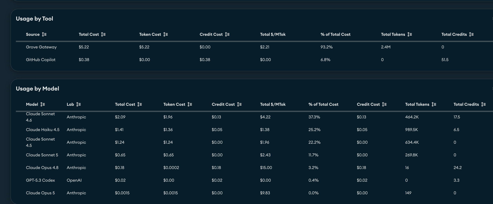
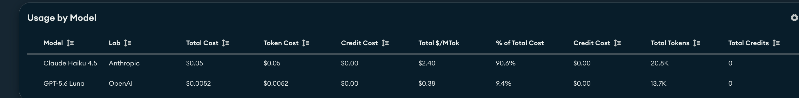

# Guia interno de custos — Grove e POVs de agentes

Referência registrada em 18/09/2026 a partir da captura fornecida por Adriano.
Uso interno para planejamento e conferência. O período e os filtros do painel não
estão visíveis na captura; os valores não devem ser atribuídos ao lote de testes
de 200 chamadas nem apresentados como tabela contratual de preços.

## Regra de uso

1. Para uma estimativa inicial, usar o **$/MTok observado do modelo** e identificar
   o resultado como estimativa pela média histórica da captura.
2. Para o cálculo por chamada na aplicação, usar as **tarifas separadas de entrada,
   saída, leitura de cache e escrita de cache**, quando confirmadas pelo Grove.
3. Manter **custo de tokens separado de custo de créditos**. A tabela por modelo
   agrega essas duas formas de cobrança; não atribuir créditos do Copilot às chamadas
   da POV pelo gateway.
4. Manter `LLM_PRICES` reservado às tarifas por tipo de token. Para destravar a
   estimativa da POV, usar `LLM_BLENDED_PRICES`, com a média histórica por modelo
   ou uma aproximação explicitamente identificada, conforme a regra vigente abaixo.
5. Não escolher o modelo apenas pelo $/MTok: comparar qualidade, latência e custo
   por tarefa resolvida no mesmo conjunto de cenários.

## Valores observados por ferramenta

Valores em USD, transcritos da captura, com o arredondamento original.

| Ferramenta | Custo total | Tokens: custo | Créditos: custo | $/MTok exibido | Tokens | Créditos |
|---|---:|---:|---:|---:|---:|---:|
| Grove Gateway | 5,22 | 5,22 | 0,00 | 2,21 | 2,4 M | 0 |
| GitHub Copilot | 0,38 | 0,00 | 0,38 | 0,00 | 0 | 51,5 |

O valor 2,21 USD/MTok é a média agregada exibida para o gateway nesse recorte,
dependente da combinação de modelos e tipos de token consumidos.

## Valores observados por modelo

| Modelo exibido | Custo total USD | Tokens: custo USD | Créditos: custo USD | $/MTok exibido | Tokens | Créditos |
|---|---:|---:|---:|---:|---:|---:|
| Claude Sonnet 4.6 | 2,09 | 1,96 | 0,13 | 4,22 | 464,2 K | 17,5 |
| Claude Haiku 4.5 | 1,41 | 1,36 | 0,05 | 1,38 | 989,5 K | 6,5 |
| Claude Sonnet 4.5 | 1,24 | 1,24 | 0,00 | 1,96 | 634,4 K | 0 |
| Claude Sonnet 5 | 0,65 | 0,65 | 0,00 | 2,43 | 269,8 K | 0 |
| Claude Opus 4.8 | 0,18 | 0,0002 | 0,18 | 15,00 | 16 | 24,2 |
| GPT-5.3 Codex | 0,02 | 0,00 | 0,02 | 0,00 | 0 | 3,3 |
| Claude Opus 5 | 0,0015 | 0,0015 | 0,00 | 9,83 | 149 | 0 |

Os nomes são os rótulos do painel, não aliases de API validados. O GPT-5.6 Luna
usado pela POV não aparece nesse recorte; GPT-5.3 Codex é outro modelo e sua linha
não fornece uma tarifa para Luna. Zero tokens e custo por créditos não significam
inferência gratuita. As amostras de 16 e 149 tokens são pequenas demais para uma
referência estável de planejamento. Arredondamentos impedem reconciliação exata
entre totais e médias usando apenas os números exibidos.

### Referência provisória para GPT Luna

Por orientação de Adriano, usar a linha GPT-5.3 Codex como referência provisória
para discussão de custos do GPT-5.6 Luna, deixando explícito que são modelos e
formas de contabilização diferentes. A captura permite apenas a razão aproximada
**0,02 USD / 3,3 créditos = 0,00606 USD por crédito**, calculada sobre valores
arredondados. Ela não fornece equivalência entre crédito e token.

Essa referência pode constar no guia interno, mas não alimenta o cálculo por tokens
da POV: o consumo Luna é reportado em tokens, sem créditos correspondentes. O
0,00 USD/MTok exibido para Codex não será usado como tarifa zero para Luna.
Essa referência por crédito não será convertida em tokens. Para viabilizar a
estimativa solicitada, Luna passa a usar a média geral do Grove, conforme abaixo.

## Fórmulas e exemplo

Estimativa de planejamento usando a média histórica:

```text
custo aproximado USD = tokens totais / 1.000.000 × USD/MTok observado do modelo
```

No lote de 100 chamadas Haiku, medimos 9.800 tokens de entrada e 6.345 de saída,
sem cache: 16.145 tokens. Aplicando a média de 1,38 USD/MTok, a estimativa seria
**0,02228 USD**. Esse valor é uma projeção pela média do painel, não o custo
confirmado daquele lote. A proporção entrada/saída pode diferir do histórico.

Cálculo por chamada quando as tarifas forem conhecidas:

```text
custo estimado USD = (
    entrada não cacheada × tarifa de entrada
  + saída × tarifa de saída
  + leitura de cache × tarifa de leitura de cache
  + escrita de cache × tarifa de escrita de cache
) / 1.000.000

custo por tarefa resolvida = custo de todas as tentativas / tarefas bem-sucedidas
```

Todas as tarifas da fórmula são USD por milhão de tokens. As categorias precisam
ser mutuamente exclusivas para não contar a entrada cacheada duas vezes. Incluir
consumo reportado de respostas truncadas e de tentativas que falharam. Se houver
consumo ou tarifa desconhecidos, explicitar a cobertura; não completar com zero.

## Conferência de novos lotes

- Registrar intervalo, fuso horário, modelo/alias, quantidade de chamadas e tokens
  de entrada, saída e cache. Para o lote de 200 chamadas: 18/09/2026,
  15:24:10–15:25:45 de Brasília (18:24:10–18:25:45 UTC).
- Filtrar o portal por Grove Gateway, modelo e intervalo, quando disponível.
  Se só houver acumulado, usar a diferença antes/depois e considerar outros usos
  da mesma chave/conta durante o intervalo.
- No lote citado, Haiku reportou 9.800 tokens de entrada e 6.345 de saída;
  GPT Luna, 8.000 de entrada e 3.183 de saída. Foram 100 chamadas completas de cada,
  sem cache e sem erros de requisição.
- Confirmar tarifas e tratamento de cache no Grove antes de atualizar `LLM_PRICES`.
  Guardar data, fonte e unidade da tarifa; não inferir o preço de entrada e saída
  a partir de um único total agregado.

## Fonte e documentação relacionada

- [Captura original do painel](assets/grove-costs-2026-09-18.png).
- [Implementação de economia, gateway e evals](../agent-quality-economics.md).



## Histórico — premissa de 18/09/2026 (substituída)

Por solicitação de Adriano, a ausência de tarifas detalhadas não bloqueia estimativas.
Configuração aplicada em `LLM_BLENDED_PRICES`:

| Modelo da POV | USD/MTok adotado | Base |
|---|---:|---|
| Claude Haiku 4.5 | 1,38 | Média observada do próprio modelo na captura |
| GPT-5.6 Luna | 2,21 | Média geral Grove Gateway, usada como aproximação interna |

A referência do Codex por créditos fica preservada acima, mas não gera essa taxa
do Luna. O valor 2,21 é uma premissa de planejamento, não uma tarifa publicada do
Luna nem um limite superior garantido. Ambos os valores têm referência em 18/09/2026.

A fórmula soma entrada não cacheada, saída, leitura e escrita de cache uma única
vez e aplica a média adotada. Não presume descontos adicionais de prompt cache;
cache semântico sem chamada LLM tem custo de inferência zero. Tarifas detalhadas
configuradas em `LLM_PRICES` têm precedência sobre a média do mesmo modelo.

Para o lote de 100 chamadas por modelo:

- Haiku: 16.145 tokens × 1,38 / 1.000.000 = **US$ 0,02228010**.
- Luna: 11.183 tokens × 2,21 / 1.000.000 = **US$ 0,02471443**.
- Total estimado das 200 chamadas: **US$ 0,04699453**, aproximadamente **US$ 0,047**.

A interface identifica a estimativa pela média histórica. Cada chamada registra
a base e o valor por milhão adotados, permitindo auditar a premissa posteriormente.
Registros anteriores não são reescritos; a estimativa aplica-se a novas chamadas.


## Regra vigente — atualização de 19/09/2026

A nova captura fornecida por Adriano identifica os dois modelos usados pela POV.
Ela substitui a média anterior do Haiku e a aproximação pela média geral para Luna.
O período/filtro não está visível; não atribuir o total da captura exclusivamente
às 200 chamadas do lote anterior.

| Modelo | Custo de tokens exibido USD | Tokens exibidos | Média adotada USD/MTok | Créditos |
|---|---:|---:|---:|---:|
| Claude Haiku 4.5 | 0,05 | 20,8 K | 2,40 | 0 |
| GPT-5.6 Luna | 0,0052 | 13,7 K | 0,38 | 0 |

Usar os valores da coluna $/MTok exibida, preservando o arredondamento do painel.
Não recalcular a média a partir de custos e volumes já arredondados. O total
exibido é US$ 0,0552; os volumes somados exibidos são 34,5 K tokens, diferentes
dos 27.328 tokens do nosso lote de 200 chamadas.

Configuração vigente:

```dotenv
LLM_BLENDED_PRICES={"claude-haiku-4-5":2.40,"gpt-5.6-luna":0.38}
```

Fórmula mantida: tokens totais não sobrepostos × média do modelo / 1.000.000.
Reestimativa do lote anterior usando estas novas médias:

- Haiku: 16.145 × 2,40 / 1.000.000 = **US$ 0,03874800**.
- Luna: 11.183 × 0,38 / 1.000.000 = **US$ 0,00424954**.
- Total estimado: **US$ 0,04299754**, aproximadamente **US$ 0,043**.

São médias observadas, não tarifas separadas de entrada/saída/cache. Nenhuma
conversão de créditos do Codex é necessária. O histórico anterior permanece como
registro da premissa substituída; traces antigos não são reescritos.


