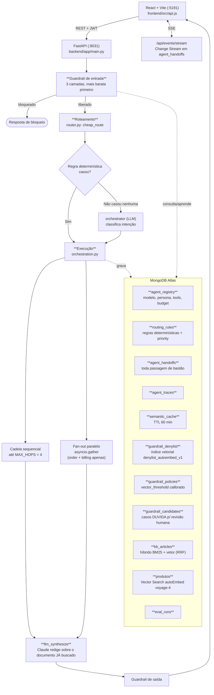
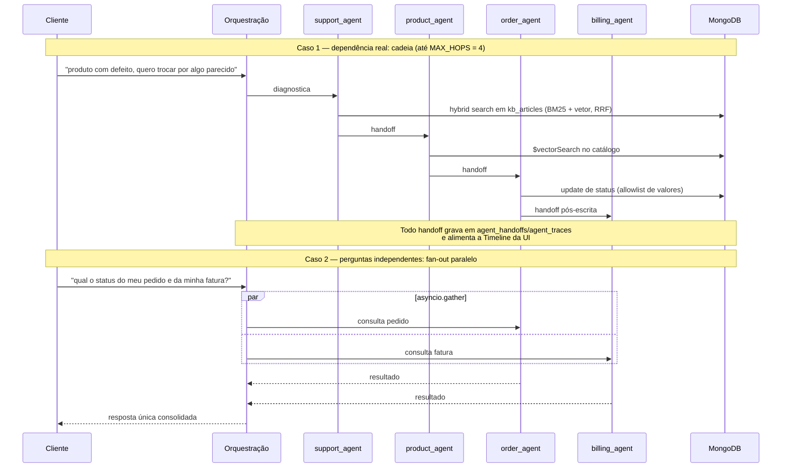
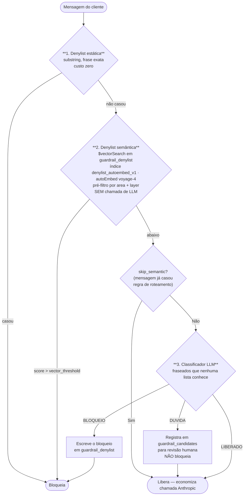

# Multi-Agent on MongoDB — Atendimento com 8 Agentes Coordenados pelo Atlas

PoV enterprise de um sistema de atendimento ao cliente multi-agente onde o **MongoDB Atlas é ao mesmo tempo o data plane e o coordination plane**. Regras de roteamento, estado dos agentes, handoffs, memória, cache semântico, decisões de guardrail e histórico de avaliação vivem como documentos MongoDB — e são consultáveis como qualquer outro dado operacional.

A tese aqui é direta: **não é preciso uma fila, um workflow engine e um vector DB separados para orquestrar agentes.** Um cluster Atlas resolve os três papéis, e o resultado é que toda decisão da orquestração fica inspecionável com uma query.

O racional completo (por que MongoDB no lugar de uma fila/engine de workflow) está em `docs/architecture.md` e `docs/adr/ADR-001-arquitetura-multi-agente.md`.

---

## 1. Os 8 agentes

Todos vivem em `ai_brain.agent_registry`. **Se o registry diz N agentes, N respondem** — uma iteração anterior inflou o registry com ~120 documentos inertes para alegar "100+ agentes"; isso foi revertido de propósito e não deve voltar.

| Agente | Domínio | Escrita permitida |
|---|---|---|
| `orchestrator` | Classificação de intenção quando nenhuma regra determinística casa | — |
| `order_agent` | Status e troca de pedido | `status` do pedido, restrito a lista de valores aprovados |
| `product_agent` | Catálogo e recomendação | — |
| `support_agent` | Diagnóstico e base de conhecimento | Abre `support_tickets` em escalação explícita |
| `billing_agent` | Faturas e cobrança | — |
| `warranty_agent` | Garantia | — |
| `loyalty_agent` | Pontos e resgates | `$inc` em `loyalty_accounts.points` + doc de auditoria em `redemptions` |
| `logistics_agent` | Entrega e reagendamento | `shipments.reschedule_requested` (campo único) |

**Configuração de agente é dado, não código.** Modelo, persona, ferramentas e budget de cada agente estão no `agent_registry`, editáveis em runtime sem redeploy (`AgentUpdate` em `backend/app/models.py`). Trocar o modelo do `support_agent` de Sonnet pra Haiku é um `update_one`.

---

## 2. Arquitetura



---

## 3. Roteamento: determinístico primeiro, LLM só como último recurso

Regra que vale a pena entender antes de mexer:

> **O LLM nunca sobrepõe uma decisão determinística já confiante.**

Quando ele podia sobrepor, a variância de sampling tornava o roteamento não-reprodutível entre mensagens quase idênticas — dois clientes escrevendo praticamente a mesma coisa caíam em agentes diferentes. Inaceitável numa demo e pior ainda em produção.

- `cheap_route` casa regras em `ai_brain.routing_rules`. Desempate por `priority` seedado.
- Intenções mais específicas (`garantia`, `fidelidade`, `logistica`) têm prioridade acima das genéricas (`status_pedido`, `fatura`), então uma mensagem composta cai no agente certo **primeiro**.
- Só quando **nenhuma** regra casa é que o `orchestrator` (LLM) entra pra classificar.

### Cadeia vs. fan-out



O fan-out é **restrito ao par `order_agent` + `billing_agent` de propósito**. `support_agent` e `product_agent` têm dependência real (diagnosticar antes de recomendar) — paralelizar esses dois produz recomendação sem diagnóstico.

Cada agente recebe instruções de grounding (`agents.py:GROUNDING_RULES`) mandando **ignorar em silêncio** as partes da mensagem fora do seu domínio. Sem isso, agente no meio da cadeia alucina política de domínio que não é dele.

### Duas armadilhas de roteamento descobertas montando os prompts de demo

- Uma palavra-chave de um agente **posterior** na cadeia pode ganhar do gatilho do agente **anterior** no desempate por prioridade e pular o hop. Ex.: "transportadora" ganhando de "troca". Solução: frasear a mensagem composta evitando a colisão (usar "entrega" em vez de "transportadora").
- Concordância de gênero em português importa em checagem de substring: "parecida" precisa da própria entrada, não basta "parecido".

---

## 4. Guardrail auto-reforçante

Três camadas, da mais barata para a mais cara:



A camada 2 é o coração: ela bloqueia **paráfrase**, de forma determinística e sem chamar LLM. E continua funcionando quando `skip_semantic` desliga o classificador ou quando a mensagem já casou uma regra de roteamento.

O terceiro veredito, `DUVIDA` (abstenção), existe porque bloquear um cliente legítimo é pior que deixar passar um caso ambíguo para revisão.

### Dois invariantes aprendidos por medição

Ambos saíram de `backend/calibrate_thresholds.py`, não de palpite:

1. **`vector_threshold` é medido contra sondas de paráfrase, nunca chutado.** Calibrar com quase-cópias da frase seedada prende o limiar na banda de "texto idêntico" e reverte o guardrail para casamento exato — ou seja, mata a camada 2 sem que ninguém perceba.
2. **As entradas lexicais são excluídas do índice vetorial pelo filtro `layer`.** Fragmentos curtos como `"sem nota fiscal"` ficam mais próximos de uma pergunta legítima (`"pode me enviar a nota fiscal da minha compra?"`, 0.826) do que de um ataque real.

`overlap_score` (Jaccard) sobrou apenas como fallback de `DEMO_MODE`/CI: ele não separa paráfrase de pergunta legítima em limiar nenhum.

---

## 5. Respostas fundamentadas: recuperação determinística, redação por LLM

Divisão explícita em `agents.py:llm_synthesize`:

- **A recuperação é 100% determinística e segura quanto a ownership.** A query Mongo é montada em Python. O modelo nunca constrói filtro.
- **A frase final é gerada pelo Claude sobre o documento já buscado.** Isso cobre fraseado arbitrário em vez de só intenções templatizadas.
- Sem API key ou com falha na chamada, cai para template f-string — então `DEMO_MODE` e CI continuam determinísticos.

---

## 6. Segurança

- **`customer_key` vem só do JWT, nunca do payload.** Toda query é filtrada por ele, e os filtros são reconstruídos no servidor.
- Ações administrativas (ligar/desligar agente, ver histórico de eval) exigem header `X-Admin-Key`.
- Conversas são limitadas: 20 mensagens, TTL 24h, retomáveis por `GET /api/conversations/latest` — que também **replica a timeline do último turno**, senão uma sessão retomada parece que nada aconteceu.
- Eventos de auditoria expiram em 30 dias.
- `budget.py` impõe budget de token por turno (`BudgetExceeded`); `rate_limit.py` é limitador de janela deslizante.
- `agent_handoffs` e `agent_traces` têm validador `$jsonSchema` (`create_schema_validators`, no-op em `DEMO_MODE`) — **o próprio MongoDB rejeita documento malformado**, não só a camada Python.

---

## 7. Escritas reais dos agentes

Um ponto que costuma ser questionado em demo: os agentes escrevem de verdade, mas com superfície mínima.

- **`order_agent`** — atualiza status do pedido, restrito a allowlist de valores. O handoff pós-escrita para `billing_agent`/`logistics_agent` roda **independente de o status ter mudado neste turno**. Depender de mudança no turno fazia o handoff sumir silenciosamente quando um turno anterior (ou um caso de eval) já tinha virado o pedido.
- **`support_agent`** — abre `support_tickets` só em escalação explícita ("atendente", "chamado", "escalar"). **Não** abre por "sem evidência no KB", porque o fallback de ranking local do `DEMO_MODE` sempre retorna *algum* artigo, relevante ou não.
- **`loyalty_agent`** — resgate real de pontos: `$inc` em `loyalty_accounts.points`, restrito à tabela de custos fixa `REWARD_CATALOG`, mais documento de auditoria em `redemptions`. Resgate por produto vira handoff para `product_agent`.
- **`logistics_agent`** — marca `shipments.reschedule_requested: true`. Campo único, nada além.

---

## 8. Recuperação e busca

| Camada | Como |
|---|---|
| Catálogo | Atlas Vector Search com Automated Embedding (`voyage-4`), ranqueado numa única agregação: relevância 0.55 + rating 0.30 + estoque 0.15 |
| Base de conhecimento | Híbrido BM25 + vetorial com RRF sobre `kb_articles` |
| Guardrail | `$vectorSearch` em `guardrail_denylist`, pré-filtrado por `area` + `layer` |
| Cache | `semantic_cache`, chave = mensagem normalizada, TTL 60 min |

---

## 9. Observabilidade ao vivo

- `GET /api/events/stream` (SSE) segue um **Change Stream** em `agent_handoffs`, filtrado às conversas do próprio chamador. Em `DEMO_MODE` cai para polling.
- O frontend mostra só o handoff mais recente e reconecta sozinho na queda (`api.js:streamEvents`).
- Todo `TimelineEvent` carrega um `op` — `read`, `write`, `vectorSearch`, `hybridSearch`, `changeStream` — renderizado como painel "coleções em ação" por turno e acumulado em contadores `collection.<nome>.<op>` (`GET /api/metrics`).

---

## 10. Abstração de armazenamento e `DEMO_MODE`

`backend/app/database.py` expõe um `DataStore` que alterna entre Atlas real e backend em memória via `DEMO_MODE`, **com os mesmos contratos**. É o que permite `smoke.py`, `eval.py` e CI rodarem sem acesso ao cluster. Sem Search/Vector Search/Change Streams reais, mas com os mesmos dados de seed e as mesmas assinaturas.

---

## 11. Frontend

O backend prova a tese; a tela é o que a banca olha. A regra aqui é simples: **a UI não decide nada**. Ela não escolhe agente, não bloqueia mensagem, não calcula custo. Tudo isso já veio decidido do backend — o frontend só mostra.

### 11.1 Stack

React 18 + Vite, JavaScript puro (`.jsx`, sem TypeScript), CSS próprio em `src/theme.css`. Sem UI kit, sem router, sem biblioteca de estado.

É deliberado. O frontend tem quatro dependências e nenhuma delas precisa de configuração. Numa POC que já carrega 8 agentes, Atlas, change stream e LLM, adicionar Redux e um design system só aumentaria a superfície de coisa pra quebrar cinco minutos antes da demo. `useState` no `App.jsx` dá conta.

| Item | Escolha |
|---|---|
| Build | Vite, dev server travado em `127.0.0.1:5191` (`--strictPort`) |
| Componentes | 4 arquivos: `Timeline`, `Inspector`, `AiBrainPanel`, mais o `App.jsx` |
| Estado | `useState` no `App.jsx`, passado por props |
| Navegação | Estado `nav` com quatro abas — sem react-router |
| Estilo | `theme.css` escrito à mão |
| API | `src/api.js` — um objeto `api` com um método por endpoint |

### 11.2 As quatro abas

Cada aba responde uma pergunta que sempre aparece na demo.

| Aba | Pergunta que responde |
|---|---|
| **Chat** | Funciona? É o palco: conversa, raio-x do turno e inspector lado a lado |
| **Agentes** | Quem são os 8? Registry vindo do Atlas, editável em modo admin |
| **Guardrails** | E se alguém tentar burlar? Só popula quando uma mensagem é de fato bloqueada |
| **Métricas** | Quanto custa? Contadores por rota, tokens, e as rodadas de avaliação |

A aba Guardrails começa vazia de propósito, com um texto explicando isso. Tela vazia com explicação é melhor que tela populada com dado falso — a primeira pergunta que vem numa banca é justamente se aquilo ali é real.

### 11.3 Componentes que importam

- **`Timeline`** — os eventos do turno em ordem. Cada `TimelineEvent` carrega um `op` (`read`, `write`, `vectorSearch`, `hybridSearch`, `changeStream`), então dá pra apontar na tela qual coleção o Atlas tocou e como. É a peça que transforma "o agente respondeu" em "o agente fez isto, nesta ordem".
- **`AiBrainPanel`** (`AiBrainHighlights` + `AiBrainInspector`) — o que o modelo viu antes de responder: memória recuperada, cache semântico, tokens gastos. Se o cache bateu, aparece ali com o custo economizado.
- **`Inspector`** — troca de visão sobre os dados brutos (agentes, handoffs, memória) sem sair do chat.
- **`ChatPanel`** — inclui os cenários de demo pré-carregados de `/api/demo-scenarios`. Ninguém digita prompt durante apresentação.

### 11.4 Contrato com o backend

Todo acesso passa por `src/api.js`. Um método por endpoint, sem fetch solto espalhado por componente:

| Método em `api.js` | Endpoint | Onde aparece |
|---|---|---|
| `login()` | `POST /api/auth/token` | Troca de identidade (Ana, Carla, Diego) |
| `chat()` | `POST /api/chat` | ChatPanel |
| `agents()` | `GET /api/agents` | Aba Agentes |
| `demoScenarios()` | `GET /api/demo-scenarios` | Botões de cenário no chat |
| `handoffs()` | `GET /api/handoffs` | Inspector |
| `memory()` | `GET /api/memory/{customer_key}` | AiBrainInspector |
| `inspector()` | `GET /api/inspector/{view}` | Inspector |
| `latestConversation()` | `GET /api/conversations/latest` | Retomar conversa ao recarregar |
| `guardrails()` | `GET /api/guardrails/{view}` | Aba Guardrails (admin) |
| `metrics()` | `GET /api/metrics` | Aba Métricas |
| `evalRuns()` | `GET /api/eval/runs` | Aba Métricas (admin) |
| `updateAgent()` | `PATCH /api/admin/agents/{key}` | Aba Agentes em modo admin |
| `streamEvents()` | `GET /api/events/stream` | Feed ao vivo de handoffs |
| `health()` | `GET /api/health` | Indicador de status |

Dois níveis de credencial: o **token JWT** do cliente vai no `Authorization` e sai do `login()`; a **chave admin** vai no header `X-Admin-Key`, lida de `VITE_ADMIN_KEY`. Rota admin sem a chave responde 403 — e isso é para ser mostrado na demo, não escondido.

### 11.5 Streaming ao vivo

`streamEvents` não usa `EventSource`. Motivo prático: `EventSource` não aceita header customizado, e o stream exige `Authorization`. Então é `fetch` + `ReadableStream`, quebrando o buffer em `\n\n` e parseando as linhas `data: `. Chunk incompleto é ignorado e volta na próxima leitura.

O toggle "ao vivo" (`liveOn`) controla um `AbortController`. Sai da aba, aborta a conexão. Em `DEMO_MODE` o backend cai para polling e o frontend não muda uma linha — o formato do evento é o mesmo.

### 11.6 O que a tela precisa provar

Se não aparece na tela, não foi demonstrado:

- **Roteamento determinístico** — qual agente pegou o turno e por qual regra, não só a resposta final.
- **Handoff entre agentes** — visível na Timeline e no feed ao vivo do change stream.
- **Cache semântico batendo** — com o custo que deixou de ser gasto.
- **Guardrail bloqueando de verdade** — a aba sai do vazio na frente do cliente.
- **Coleções em ação por turno** — o `op` de cada evento, mostrando Atlas como vector store, search engine e stream ao mesmo tempo.

### 11.7 Build e ambiente

```bash
cd frontend && npm install && npm run dev   # 127.0.0.1:5191, porta travada
```

`frontend/.env` (a partir do `.env.example`):

```
VITE_API_URL=http://127.0.0.1:8031
VITE_ADMIN_KEY=troque-a-chave-administrativa
```

A porta 5191 está fixada com `--strictPort` porque esta máquina roda várias POCs ao mesmo tempo — se estiver ocupada, o Vite falha em vez de escorregar para outra porta e deixar o `VITE_API_URL` apontando pro lugar errado. Trocar de porta exige mexer no `package.json` e neste documento juntos.

---

## 12. Como rodar

### Setup
```bash
cp .env.example .env
python3.12 -m venv .venv
source .venv/bin/activate
pip install -r backend/requirements.txt
python backend/seed.py
```

### Backend — porta 8031, estrita (sai se ocupada, sem fallback automático)
```bash
cd backend && python run.py
```

### Backend sem Atlas
```bash
cd backend && DEMO_MODE=1 AUTH_REQUIRED=1 python run.py
```

### Frontend — porta 5191, estrita
```bash
cd frontend && npm install && npm run dev
```

### Testes e avaliação
```bash
cd backend && pytest -q                                   # suíte completa
cd backend && pytest tests/test_router.py::test_name -q   # teste único
python backend/tests/smoke.py http://127.0.0.1:8031       # black-box contra servidor rodando; exit != 0 em falha
python backend/eval.py http://127.0.0.1:8031              # golden dataset (seed_data.py:EVAL_CASES) -> eval_runs
cd backend && python calibrate_thresholds.py              # mede a banda de score do denylist (--apply grava vector_threshold)
cd backend && ruff check .
cd frontend && npm run build
```

### Antes de uma demo ao vivo — pré-aquecer o cache
```bash
python backend/warmup.py http://127.0.0.1:8031
```

Chama todos os prompts de demo não-guardrail (espelha `frontend/src/App.jsx:DEMOS_BY_IDENTITY` literalmente — a chave de cache é a mensagem normalizada), uma vez por identidade, **de verdade, contra a Anthropic**. Não é uso fabricado: o primeiro turno real já aconteceu no warmup, então o clique ao vivo é um `cache_hit: true` genuíno reproduzindo a timeline armazenada. O TTL de 60 min do `semantic_cache` foi escolhido para sobreviver da preparação até a reunião.

---

## 13. Roteiro de demonstração

1. **Pergunta composta independente** — status do pedido + fatura. Mostrar o fan-out paralelo na Timeline.
2. **Pergunta com dependência real** — defeito + troca. Mostrar a cadeia de 4 hops, cada handoff virando documento no Atlas.
3. **Abrir o Inspector.** Cada turno mostra quais coleções foram tocadas e com qual operação. A orquestração é auditável por query, não por log.
4. **Tentar burlar o guardrail com paráfrase.** Bloqueia sem chamar LLM — é a camada vetorial.
5. **Tentar um fraseado novo.** O classificador pega, **grava na denylist**, e a próxima tentativa parecida sai de graça.
6. **Trocar o modelo de um agente ao vivo** no `agent_registry` e refazer a pergunta. Sem redeploy.
7. **Mostrar `eval_runs`** — histórico de pass/fail do golden dataset. Regressão de agente é mensurável.

---

## 14. Lacunas conhecidas

Verificadas contra o código, não só contra a documentação:

- Métricas (`backend/app/metrics.py`) são em processo, resetam no restart. Sem persistência nem agregação entre instâncias.
- Sem CI, sem Docker, sem configuração de deploy. Desenvolvimento local apenas, via venv + npm, com portas estritas sem fallback.
- Síntese por LLM e guardrail semântico custam tokens Anthropic reais por turno. Aceitável para demo; exigiria ajuste de cache/amostragem antes de volume de produção.

---

## 15. Caminho para produção

| Item | No PoV | Em produção |
|---|---|---|
| Identidade | JWT emitido pelo próprio `/api/auth/token` | IdP corporativo (OIDC); `customer_key` das claims |
| Métricas | Em processo | Exportador para Prometheus/Datadog, agregado entre instâncias |
| Deploy | venv + npm local | Container por serviço, pipeline com o `eval.py` como gate de regressão |
| Custo de LLM | Chamada por turno | Cache semântico mais agressivo + roteamento por tier de modelo (registry já suporta) |
| Guardrail | Calibrado contra sondas seedadas | Recalibração periódica contra tráfego real rotulado; `guardrail_candidates` vira fila de curadoria |
| Schema | Validador `$jsonSchema` em 2 coleções | Validador em todas as coleções de coordenação, com `validationAction=error` |

Convenção do repositório: **documentação e textos de UI em português; código e comentários em inglês.**
